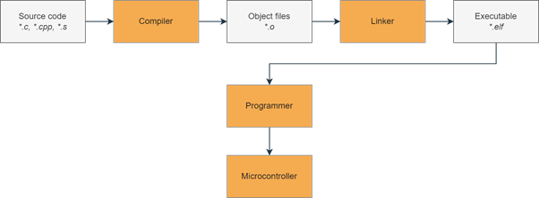

STM32F411
=========

STM32F411 microcontrollers are a part of the STM32 Dynamic Efficiency line based on **ARM Cortex-M4** core, part of the **ARMv7-M** architecture. They are considered entry-level microcontrollers from a high-performing F4 series. These microcontrollers offer a good balance of energy consumption and performance.

**Physical features**

- **Operating voltage**: 1.7 V to 3.6 V
- **Temperature range**: -40°C to 85/105/125 °C

**Performance and processing**

- **Operating frequency**: up to 100 MHz
- **FPU** (Floating Point Unit) - Allows faster processing of decimal numbers.
- **ART** (Adaptive Real-Time Accelerator) - Accelerator designed for faster access to FLASH memory.
- **DSP** (Digital Signal Processing) - Set of instructions used to process signals, useful for audio, video, and analog signals.
- **BAM** (Batch Acquisition Mode) - Enables data exchange through communication peripherals with the rest of the microcontroller while in power-saving mode.
- **DMA** (Direct Memory Access) - Allows certain hardware components to access system memory directly, without involving the CPU. This enables autonomous data transfer between memory and peripherals, freeing up the CPU for other tasks or even allowing it to enter low-power mode.
- **CRC** (Cyclic Redundancy Check) - Error-detecting code useful for detecting accidental changes or corruption in data as it is transferred or stored.

**Memory**

- **Flash memory**: 256-512 kB
- **RAM memory**: 128 kB

**Communication interfaces**

- **USART**: 3x USARTs, up to 1.25 Mbps
- **SPI**: 5x SPI interfaces
- **I²C**: 3x I²C interfaces, up to 1 Mbps
- **SDIO**: 1x SDIO, up to 48 MHz
- **USB**: 1x USB 2.0 OTG
- **I²S**: 2x full duplex I²S interfaces

**Analog features**

- **A/D converter**: 1x12-bit, up to 16 channels

**Timers**

- **Timers**: 11 total - up to six 16-bit and two 32-bit, up to 100 MHz

**Registers**

In a microcontroller, **registers** are small, high-speed storage locations within the processor that hold data temporarily. They control various aspects of the microcontroller's operation by allowing the CPU to quickly access and manipulate data, configure settings, and manage peripherals.

Some of the registers included are:

- **General-purpose registers** - Temporary storage locations within the microcontroller that hold data needed during arithmetic and logic operations.

- **Special-purpose registers** - Designed to manage particular tasks or operations, such as program counters, stack pointers, and interrupt vectors.

- **Control registers** - Configure the behavior and settings of various microcontroller features and peripherals. By writing specific values to control registers, developers can enable or disable functions, set modes of operation, and adjust parameters for features like timers, communication protocols, and interrupt priorities.

- **Status registers** - Provide real-time information about the current state of the microcontroller or specific peripherals. These registers contain flags or bits that reflect conditions such as carry, zero, overflow, or whether an operation has completed.

**The Build Process**

First, the source files are passed into the **compiler**, which turns them into individual object files. The object files are then "linked together" by the **linker** to form an executable. Finally, we use a **programmer** to upload the executable to the microcontroller, which then executes the code.

The figure below shows a simplified diagram for this process:

