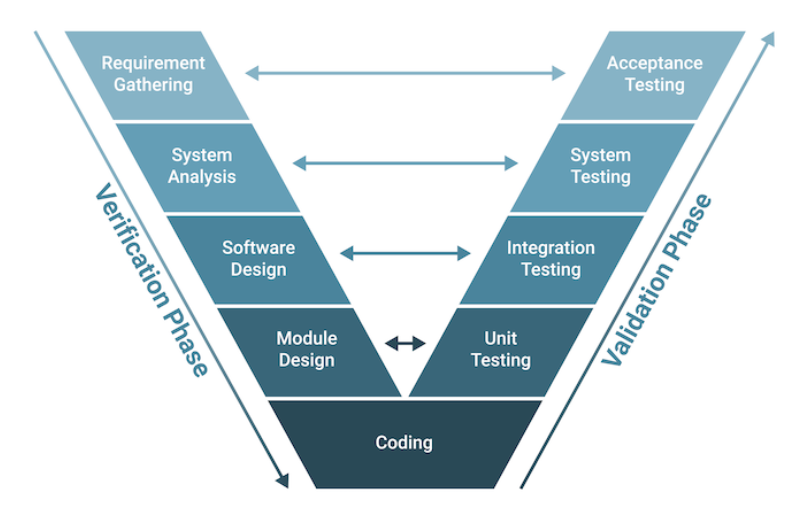

=================
V-Model Overview
=================

----------------
Introduction
----------------
The **Software Development Life Cycle (SDLC)** is a structured process that outlines the stages involved in software development, from an initial concept to deployment and maintenance. It ensures that software is built systematically, following specific steps to meet both functional and quality requirements. The main stages in SDLC include planning, analysis, design, implementation, testing, deployment, and maintenance. Each phase has its own objectives and deliverables, and the goal is to improve software quality, reduce development time, and meet user expectations.

The V-Model is an SDLC approach that emphasizes verification and validation. Named for its "V" shape, it aligns each development phase with a corresponding testing phase, creating a visual structure resembling a "V." The left side of the "V" represents the stages of defining requirements and designing the system, while the right side focuses on testing and validation. 

----------------------
Phases of the V-Model
----------------------

The phases of the V-model include the verification phase, coding, and the validation phase. Key stages include requirements analysis, system design, architecture design, module design, coding, and then various levels of testing like unit, integration, system, and acceptance testing.
The most important points for each stage are:

**1. Requirements Analysis** 
  - **Goal:** Define and document system requirements based on user needs.
  - **Outcome:** A Requirements Specification Document.
  - **Testing Phase:** Acceptance Testing – Ensures the final product meets user needs and expectations.

**2. System Design**
  - **Goal:** Translate requirements into high-level system design.
  - **Outcome:** System architecture outlining major components and relationships.
  - **Testing Phase:** System Testing – Tests the entire system's functionality against the initial requirements.

**3. Architecture Design**
  - **Goal:** Break down the system design into subsystems and modules.
  - **Outcome:** Detailed module specifications.
  - **Testing Phase:** Integration Testing – Ensures that modules work together as intended.

**4. Module Design (Detailed Design)**
  - **Goal:** Design each module in detail, specifying algorithms and data structures.
  - **Outcome:** Module specifications and design documents.
  - **Testing Phase:** Unit Testing – Verifies that each module functions independently.

**5. Coding**
  - **Goal:** Implement the modules based on design specifications.
  - **Outcome:** Executable software modules.
  - **Testing Phase:** Execution of Unit, Integration, System, and Acceptance Tests – Completes the “V” shape by testing at each level to ensure quality and functionality.

-----------------------------
Advantages of the V-Model:
-----------------------------
The V-Model has many benefits that make it a structured and quality-focused approach to software development:

- Its straightforward and easy to grasp, which makes it accessible for team members and customers alike
- Each phase is completed in a disciplined, step-by-step sequence, which enhances thoroughness and reduces errors
- Testing is prioritized, improving software quality and reliability by catching issues early on
- The model's clear, structured framework simplifies tracking progress, helping project management keep development on course
- Traceability is enhanced, as each requirement is linked directly to the final product, making changes easier to follow
- With a strong emphasis on documentation, the V-Model provides a transparent process that improves communication between developers and customers

------------------------------
Disadvantages of the V-Model:
------------------------------
While useful in many scenarios, the V-Model has limitations, especially when dealing with flexible or evolving project requirements:

- It's not suitable for projects with a high level of uncertainty or where requirements may change, as it lacks flexibility
- The linear, sequential nature of the V-Model can make it challenging to adapt to new needs or events mid-project
- Since it doesn't allow for concurrent phase execution, it can be slower and more time-intensive than other models
- The V-Model requires substantial documentation and testing, which, while valuable, can sometimes take time away from actual development work
- This approach can create an overreliance on documentation, slowing down progress if developers become too focused on formalities rather than the iterative development itself

-------------
Conclusion
-------------
The V-Model in software development is an extension of the traditional Software Development Life Cycle (SDLC) that focuses heavily on verification and validation at every stage. Unlike linear models, the V-Model arranges development activities on the left side of the "V" and aligns them with corresponding testing activities on the right side. This creates a visual representation where each development phase has a paired testing phase, ensuring early and consistent attention to quality.